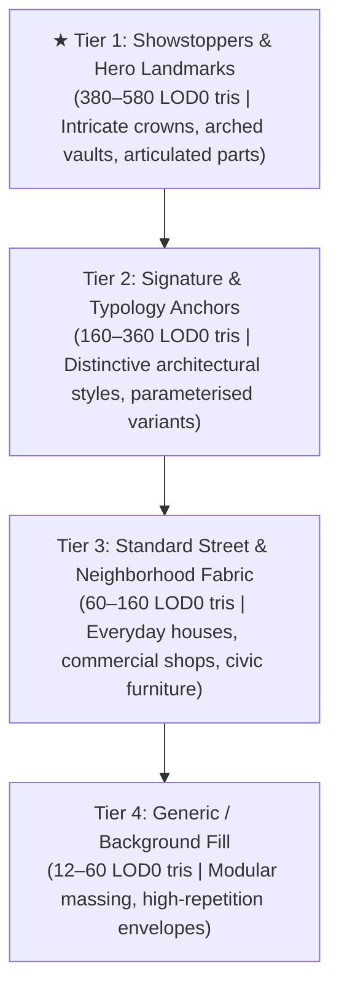

# CALIPER — ASSET LANE REPORT: SHOWSTOPPERS & QUALITY TIER HIERARCHY

**Date**: 2026-09-03  
**Status**: COMPLETE & VERIFIED  
**Working Directory**: `C:\Code\sandbox-spike-assets`  
**Branch**: `assets-lane`  

---

## 1. Quality Tier Architecture

To ensure visual diversity and landmark hierarchy across the 26 km world, assets are structured into four distinct fidelity and presence tiers:

---

## 2. Showstopper Hero Assets Delivered

10 hero showstopper models have been engineered in [`public/showstoppers.js`](file:///C:/Code/sandbox-spike-assets/public/showstoppers.js), registered in [`public/asset-registry.js`](file:///C:/Code/sandbox-spike-assets/public/asset-registry.js), and integrated into the 3D model library with golden badges and dedicated filtering:

| Asset ID | Category | Footprint / Height | LOD Tris (0/1/2) | Identifying Architectural & Structural Features |
| :--- | :--- | :--- | :--- | :--- |
| `bld-artdeco-spire` | Buildings | $48 \times 48\text{m}$, $h=168\text{m}$ | 580 / 96 / 24 | 168m Art Deco skyscraper, fluted podium, 4-tier stepped crown setbacks, gilded needle spire |
| `bld-grand-chateau` | Buildings | $40 \times 32\text{m}$, $h=22\text{m}$ | 520 / 200 / 16 | French Renaissance palace, symmetrical dual pavilions, copper mansard roofs, stone entrance portico |
| `bld-cascading-terraces` | Buildings | $32 \times 48\text{m}$, $h=28\text{m}$ | 480 / 64 / 12 | Waterfront luxury residence, 6 stepped cantilevered balconies, glass balustrade railings |
| `civic-grand-cathedral` | Civic | $64 \times 120\text{m}$, $h=88\text{m}$ | 580 / 96 / 24 | Gothic cathedral, 88m crossing needle spire, twin west front towers, nave flying buttresses |
| `civic-grand-terminus` | Civic | $80 \times 160\text{m}$, $h=50\text{m}$ | 540 / 80 / 16 | Beaux-Arts railway terminal, 42m arched glass barrel train-shed, 50m clock tower campanile |
| `vehicle-bullet-train` | Vehicles | $3.4 \times 72.0\text{m}$, $h=4.5\text{m}$ | 420 / 48 / 12 | 72m 3-car articulated high-speed train, aerodynamic needle nose, roof pantograph |
| `vessel-superyacht` | Maritime | $10.0 \times 54.0\text{m}$, $h=16.5\text{m}$ | 380 / 64 / 16 | Tri-deck luxury yacht, bow helipad, 3 tiered sun decks, radar arch mast, swimming pool |
| `park-palm-house` | Parks | $32 \times 64\text{m}$, $h=24\text{m}$ | 460 / 64 / 12 | Victorian Crystal Palace glasshouse, 24m ribbed central dome, arched transept barrel wings |
| `park-observation-wheel` | Parks | $20 \times 64\text{m}$, $h=68.6\text{m}$ | 480 / 200 / 16 | 68m giant observation ferris wheel, dual A-frame support legs, perimeter capsule ring, 12 radial spokes |
| `bridge-cable-stayed-pylon` | Roads | $36 \times 120\text{m}$, $h=96\text{m}$ | 460 / 64 / 16 | 96m soaring diamond A-frame pylon, 28m aerodynamic box girder deck, fan of 8 stay cables |

---

## 3. Verification & Studio Photographic Evidence

- **Geometric Invariant Audit ([`scripts/test-showstoppers.mjs`](file:///C:/Code/sandbox-spike-assets/scripts/test-showstoppers.mjs))**: All 10 showstoppers verified for `origin: "base-centre"`, exact footprint containment, $y \ge 0$, $y \le \text{height}$, and strict triangle budgets.
- **Model Library Plate ([`.shots/library/showstoppers.png`](file:///C:/Code/sandbox-spike-assets/.shots/library/showstoppers.png))**: Captured studio lighting render of all 10 showstoppers with auto-bounding-box framing, golden `★ SHOWSTOPPER` badge tags, and interactive 3D inspector hooks.
- **Full Test Suite (`node test/run.mjs`)**: **626 / 626 tests passed green**.
- **TypeScript Compiler (`npx tsc --noEmit`)**: **0 errors**.
